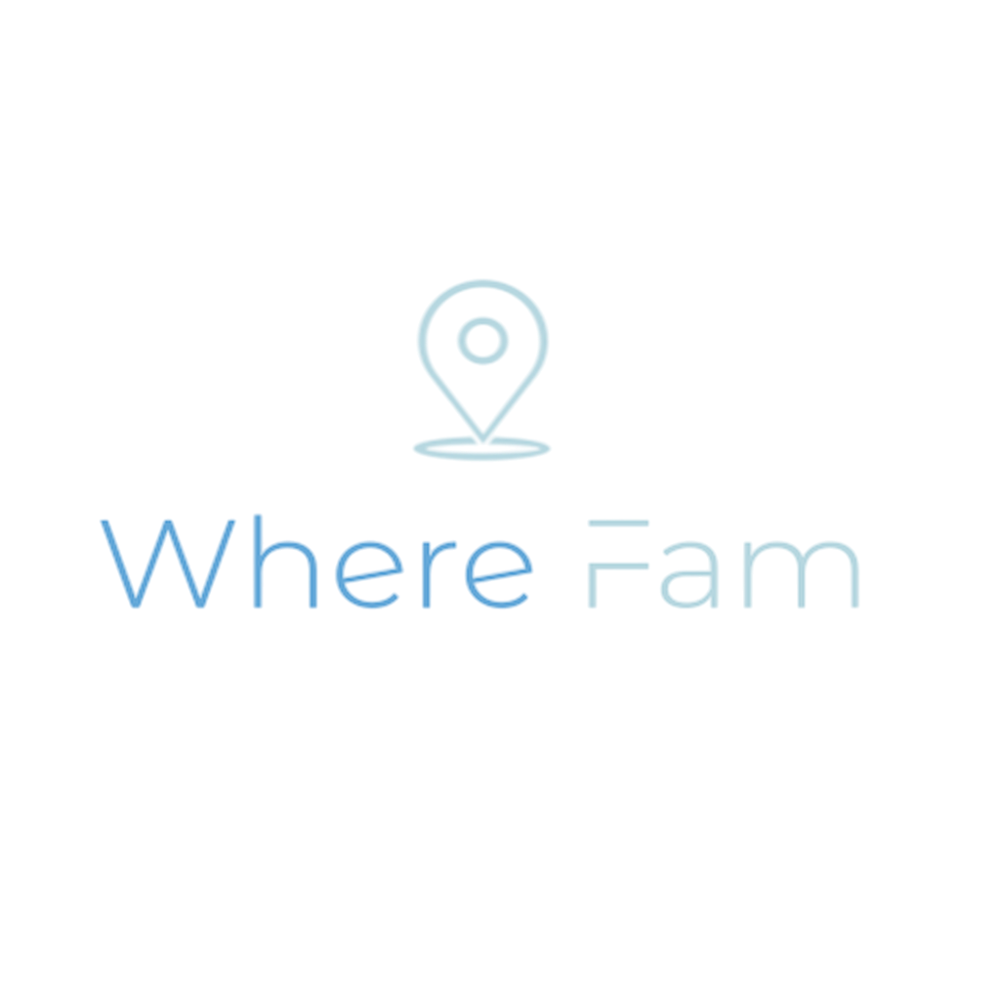

[](pear://keet/yfou1k336h5ieixwah4qjxsbx1x889fnefmfkr3o6e5amwfqqjy343qk8ze35f8mbtu4podrmpqm3tqfnc1a3xphpe5btjsinxurjsq17omodj3jne9ho3xmh5g6gqkhtu1gq5uhk1mt9x88a9q1jgfhbumanye)

<p align="center">
  
  
</p>

## About
The goal of the project is to enable real-time location sharing without relying on the cloud, utilizing a peer-to-peer (P2P) connection instead!! This was possible due to hard work of [Holepunch](https://holepunch.to/) Team ([Mathias](https://github.com/mafintosh) huge credits to him for his dedication in P2P space, [Lord Kasper](https://github.com/kasperisager), [Sean](https://github.com/lejeunerenard) and sorry to others if I have forgotten to mention)

## Roadmap
- [ ] Group Based location sharing
- [ ] Places alerts
- [ ] Location History
- [ ] Local Roadside Assitance
- [ ] SOS alerts / Emergency services

## Building
- [ ] Clone the project
- [ ] Follow the steps below
- [ ] Don't forget to run `npm install`

To keep the build process fast and efficient, the project relies on a Bare Kit prebuild being available in the [`app/frameworks/`](app/frameworks) directory. Prior to building the project, you must therefore either clone and compile Bare Kit from source, or download the latest prebuild from GitHub. The latter is easily accomplished using the [GitHub CLI](https://cli.github.com):

```console
gh release download --repo holepunchto/bare-kit <version>
```

Unpack the resulting `prebuilds.zip` archive and move `ios/BareKit.xcframework` into [`app/frameworks/`](app/frameworks). When finished, generate the Xcode project files using <https://github.com/yonaskolb/XcodeGen>:

```console
xcodegen generate
```

Then, either open the project in Xcode or build it from the commandline:

```console
xcodebuild -scheme App build
```

### Addons

Native addons will be linked into [`app/addons/`](app/addons) as part of the build process and must be referenced in [`app/addons/addons.yml`](app/addons/addons.yml) to ensure that Xcode copies them to the final app bundle. After installing `bare-addon` v1.2.3, for example, do:

```diff
 targets:
   App:
-    dependencies: []
+    dependencies:
+      - framework: bare-addon.1.2.3.xcframework
```

Make sure to regenerate the project files after editing the addons list:

```console
xcodegen generate
```
